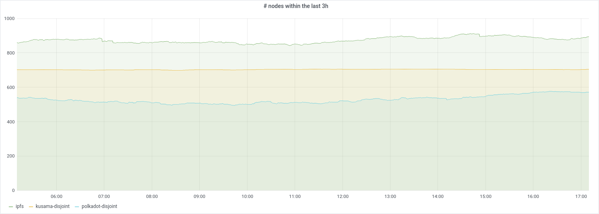
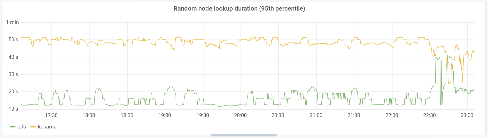

## Kademlia Exporter

Exporter exposing [Prometheus](https://prometheus.io/) metrics for
[libp2p](https://github.com/libp2p/) Kademlia distributed hash tables.







*Information below is likely outdated. Code is the source of truth.*


### Quickstart

```bash
cargo run -- --config-file config.toml

curl localhost:8080/metrics
```


### Ip localization

Optionally the exporter can estimate a peers location through the [Max Mind Geo
DB](https://dev.maxmind.com/geoip/geoip2/geolite2/#Autonomous_System_Numbers).
See `max_mind_db_path` parameter in `config.toml`.


### Cloud provider

Optionally the exporter can estimate the cloud provider a peer is hosted in via
a list of CIDRs. See `.assets/cidrs.r` to generate a list and
`cloud_provider_cidr_db_path` parameter in `config.toml` to specify the
generated `.csv` file.


### Metrics

- `kademlia_exporter_network_behaviour_events` Libp2p network behaviour events.

- `kademlia_exporter_kad_random_node_lookup_duration` Duration of random Kademlia node lookup.

- `kademlia_exporter_kad_query_stats` Kademlia query statistics (number of requests, successes, failures and duration).

- `kademlia_exporter_ping_duration` Duration of a ping round trip.

- `kademlia_exporter_meta_random_node_lookup_triggered` Number of times a random Kademlia node lookup was triggered.

- `kademlia_exporter_nodes_seen_within` Unique nodes discovered within the time bound through the Dht.

- `kademlia_exporter_nodes_up_since` Unique nodes discovered through the Dht and up since timebound.

- `kademlia_exporter_meta_offline_nodes_removed` Number of nodes removed due to being offline longer than 24h.
